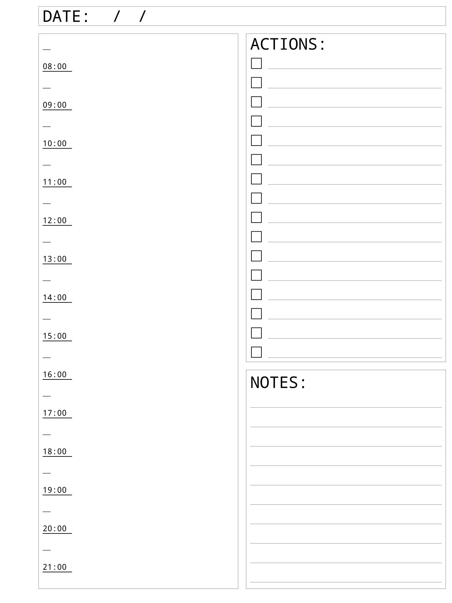

# GTD Templates for Remarkable
Contains templates for GTD writting in tex and utilities for generating svg/png files and uploads templates to remarkable.

## Examples

|  |  |  |
| --- | --- | --- |
|  |  |  
|  |  |  |

## Installation
The code has been tested using the following setup:

- Ubuntu 18.04
- Python 3.8.0
- pdflatex

### LaTeX
A LaTeX compiler for generating the pdf containing the templates. Sevaral LaTeX packages are required, which can be found in the `gtd.tex` file.

### Converting
For converting the pdf to separate png and svg files three linux command line tools are used:
- `pdfseparate` (standard available on Ubuntu)
- `pdf2svg` (standard available on Ubuntu)
- `rsvg-convert` (can be installed using `sudo apt-get install librsvg2-bin`)

### Uploading
The files can be uploaded automatically to the Remarkable over SSH. The python script has two requirements which can be installed by running `python -m pip install -r requirements.txt`.

## Usage
The tex filename and template names have to specified in the  `names.txt` file. The first line is the name of the tex file (e.g., `gtd`), each following line specifies a template name. This means the number of lines in the `names.txt` file has to equal to the number of pages + 1 of the pdf file. 

The generated pdf can be converted using the `convert.py` script. The png/svg files and a templates.json file will be placed in the files directory. The templates can automatically be uploaded using the `upload.py` script or can be manually copied onto your remarkable.

Commands:
- `make pdf` generates pdf using `pdflatex`.
- `make convert` converts pdf to png and svg using (`pdfseparate`, `pdf2svg` and `rsvg-convert`).
- `make upload` uploads templates to remarkable and updates the `templates.json` file.
- `make clean` deletes latex build files and files directory.
- `make` runs `pdf`, `convert` and `upload` in sequence.

## Notes
### Page Sizes
`pdf2svg` uses a dpi of 90.0

- Width: 1404 pixels = 15.6in
- Height: 1872 pixels = 20.8in
- Left: 120 pixels = 1.33in
- Top: 20 pixels = 0.22in
- Right: 20 pixels = 0.22in
- Bottom: 20 pixels = 0.22in